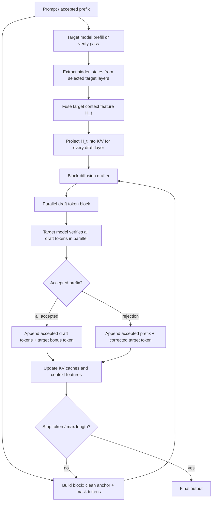

## 1. Abstraction
DFlash accelerates autoregressive LLM decoding by replacing sequential autoregressive drafting with a **lightweight block-diffusion drafter**. At each decoding cycle, the target model supplies rich hidden context features. DFlash fuses these features and injects them into every draft layer’s key-value cache, then predicts a block of future masked tokens in parallel. The target LLM verifies the block in one parallel pass using standard speculative decoding. The key benefit is that draft latency no longer scales linearly with the number of draft tokens, while target-feature conditioning keeps draft quality high enough to obtain long acceptance lengths.

## 2. Dflash
### 2.1. Algorithm details


### 2.2. Psuedo code
**Training light weight block diffusion drafter model**
```text
Algorithm: DFlash Inference
Inputs:
  target model M_t
  block-diffusion draft model M_d
  prompt x_1:n
  block size B
  selected target layers L = {l_1, ..., l_s}

Initialize output y = prompt
Run M_t prefill on y
Sample or greedily decode the first target token x_next
Append x_next to y
Extract hidden states H^(l_1), ..., H^(l_s) from M_t
Fuse target context: H_t = RMSNorm(W_c [H^(l_1); ...; H^(l_s)])
Initialize target KV cache and draft KV cache

while not finished:
    # 1. Build masked block
    anchor = last accepted token in y
    block_input = [anchor, <mask>, <mask>, ..., <mask>]  # length B

    # 2. Inject target context into every draft layer
    for each draft layer i:
        K_i_target = W_i^K H_t
        V_i_target = W_i^V H_t
        store (K_i_target, V_i_target) in draft KV cache

    # 3. Parallel block-diffusion draft
    draft_logits = M_d(block_input, draft_KV_cache)
    draft_tokens = decode all masked positions in parallel
    draft_probs = probabilities assigned by M_d

    # 4. Parallel target verification
    target_logits = M_t(y + draft_tokens, target_KV_cache)
    target_probs = probabilities assigned by M_t

    # 5. Accept prefix of draft
    accepted = []
    for i from 1 to len(draft_tokens):
        if verification_accepts(draft_tokens[i], draft_probs[i], target_probs[i]):
            append draft_tokens[i] to accepted
        else:
            corrected = sample_from_adjusted_target_distribution(target_probs[i], draft_probs[i])
            append corrected to accepted
            break

    append accepted to y
    update target KV cache
    extract/fuse new target context features from verified target pass

return y
```

**Inference**
```text
Algorithm: DFlash Inference
Inputs:
  target model M_t
  block-diffusion draft model M_d
  prompt x_1:n
  block size B
  selected target layers L = {l_1, ..., l_s}

Initialize output y = prompt
Run M_t prefill on y
Sample or greedily decode the first target token x_next
Append x_next to y
Extract hidden states H^(l_1), ..., H^(l_s) from M_t
Fuse target context: H_t = RMSNorm(W_c [H^(l_1); ...; H^(l_s)])
Initialize target KV cache and draft KV cache

while not finished:
    # 1. Build masked block
    anchor = last accepted token in y
    block_input = [anchor, <mask>, <mask>, ..., <mask>]  # length B

    # 2. Inject target context into every draft layer
    for each draft layer i:
        K_i_target = W_i^K H_t
        V_i_target = W_i^V H_t
        store (K_i_target, V_i_target) in draft KV cache

    # 3. Parallel block-diffusion draft
    draft_logits = M_d(block_input, draft_KV_cache)
    draft_tokens = decode all masked positions in parallel
    draft_probs = probabilities assigned by M_d

    # 4. Parallel target verification
    target_logits = M_t(y + draft_tokens, target_KV_cache)
    target_probs = probabilities assigned by M_t

    # 5. Accept prefix of draft
    accepted = []
    for i from 1 to len(draft_tokens):
        if verification_accepts(draft_tokens[i], draft_probs[i], target_probs[i]):
            append draft_tokens[i] to accepted
        else:
            corrected = sample_from_adjusted_target_distribution(target_probs[i], draft_probs[i])
            append corrected to accepted
            break

    append accepted to y
    update target KV cache
    extract/fuse new target context features from verified target pass

return y
```

### 2.3. Training details
#### Standard speculative decoding objective

Let:

- $M_t$ be the frozen target LLM.
- $M_d$ be the **lightweight block-diffusion** draft model.
- $\gamma$ be the draft block size.
- $T_{\text{draft}}$ be drafting latency per cycle.
- $T_{\text{verify}}$ be target verification latency per cycle.
- $\tau \in [1, \gamma + 1]$ be expected accepted tokens per cycle, including the target model’s bonus token.
- $L_{\text{target}}$ be target-only autoregressive latency per token.

DFlash uses the same speedup accounting as speculative decoding:

$$
L = \frac{T_{\text{draft}} + T_{\text{verify}}}{\tau},
\qquad
\eta = \frac{L_{\text{target}}}{L}.
$$

Thus, speedup improves by either decreasing draft/verify cost or increasing $\tau$.

#### Why diffusion drafting changes the latency scaling

For an autoregressive drafter, drafting $\gamma$ tokens costs approximately

$$
T_{\text{draft}}^{\text{AR}} = \gamma \cdot t_{\text{step}},
$$

where $t_{\text{step}}$ is the latency of one draft forward pass.

For DFlash’s block-diffusion drafter, all $\gamma$ positions are predicted in one parallel pass:

$$
T_{\text{draft}}^{\text{DFlash}} = t_{\text{parallel}},
\qquad
 t_{\text{parallel}} \ll \gamma \cdot t_{\text{step}}.
$$

This is the central systems advantage: DFlash can use a deeper and more expressive draft model without paying $\gamma$ sequential draft steps.

#### Target-context feature fusion

DFlash extracts hidden states from selected target-model layers $l_1, \dots, l_s$ and fuses them into a compact target context feature:

$$
H_t = \operatorname{RMSNorm}\left(W_c\,[H^{(l_1)}; H^{(l_2)}; \dots; H^{(l_s)}]\right).
$$

In the main DFlash setup, $s=5$ target hidden layers are selected uniformly from shallow to deep layers.

#### KV injection into each draft layer

At draft layer $i$, let $H_d$ be draft-token hidden states and $H_t$ be fused target features. DFlash uses draft tokens to produce queries, while both target features and draft tokens become keys and values:

$$
Q_i = W_i^Q H_d,
$$

$$
K_i = [W_i^K H_t;\; W_i^K H_d]_{\text{seq}},
$$

$$
V_i = [W_i^V H_t;\; W_i^V H_d]_{\text{seq}}.
$$

The target features serve as persistent context entries in the KV cache. They do not pass through the draft model’s query projection, output projection, FFN, or self-attention update. This keeps overhead small while exposing every draft layer to the target model’s internal representation.

#### Block-diffusion draft distribution

Given prefix tokens $x_{\le j}$, a clean anchor token $x_j$, and $\gamma-1$ mask positions, DFlash predicts a block:

$$
\hat{x}_{j+1:j+\gamma-1}
\sim
M_d(\cdot \mid x_{\le j}, H_t, [x_j, \texttt{<mask>}, \dots, \texttt{<mask>}]).
$$

Within a block, DFlash uses bidirectional attention among block positions. Across different training blocks, attention is masked so that there is no information leakage.

#### Weighted training loss

For an anchor-started block, DFlash predicts masked future tokens in parallel. Early positions matter more because one early rejection invalidates later draft tokens. DFlash therefore uses exponentially decayed per-position weights:

$$
w_k = \exp\left(-\frac{k-1}{\gamma_{\text{loss}}}\right),
$$

where $k$ is the position inside the draft block and $\gamma_{\text{loss}}$ controls decay. A compact form of the training objective is:

$$
\mathcal{L}_{\text{DFlash}}
= \sum_{b \in \mathcal{B}} \sum_{k=1}^{B-1}
 w_k \cdot \operatorname{CE}\left(x_{a_b+k},\; p_\theta(x_{a_b+k}\mid H_t, x_{a_b}, \texttt{<mask>}_{1:B-1})\right),
$$

where $a_b$ is a randomly sampled anchor position and $B$ is the training block size.

### 2.7 Speculative verification and losslessness

For sampling, if the draft token $\hat{x}_{j+i}$ has draft probability $q_i(\hat{x}_{j+i})$ and target probability $p_i(\hat{x}_{j+i})$, standard speculative decoding accepts it with probability

$$
A_i = \min\left(1, \frac{p_i(\hat{x}_{j+i})}{q_i(\hat{x}_{j+i})}\right).
$$

If a token is rejected, following draft tokens are discarded and a corrected token is sampled from the adjusted target distribution. For greedy decoding, verification reduces to checking whether draft tokens match the target argmax path. This target verification step is what keeps DFlash output lossless relative to the target model.


## 4. Comparision with Vanilla Decode, Standard Speculative Decoding, EAGLE-2, EAGLE-3, Multiple Token Prediction (MTP),
| Algorithm | Draft mechanism | Uses target hidden features? | Draft parallelism | Verification | Lossless relative to target? | Main limitation |
|---|---:|---:|---:|---:|---:|---|
| Vanilla autoregressive decoding | No draft; target emits one token at a time | No | No | No | Yes | Sequential latency |
| Standard speculative decoding | Small autoregressive draft LLM | Usually no | Sequential draft, parallel verify | Target verifies draft sequence | Yes if strict speculative sampling | Draft model may be expensive or low quality |
| EAGLE | Autoregressive feature-level drafter predicts second-to-top-layer feature, then target LM head maps to tokens | Yes, top-layer/near-top features | Sequential/tree autoregressive drafting | Tree attention verification | Yes | Static tree and feature-prediction constraint |
| EAGLE-2 | Same EAGLE drafter, but dynamic draft tree | Yes | Sequential/tree autoregressive drafting | Tree attention verification | Yes | Still uses autoregressive feature drafting |
| EAGLE-3 | Direct token prediction with training-time test and multi-layer feature fusion | Yes, fused low/mid/high features | Sequential/tree autoregressive drafting | Dynamic tree verification | Yes | Drafting remains autoregressive |
| MTP / Multi-token Prediction | Multiple future-token heads on one model trunk | Internal to same model | Multiple heads can support self-speculative decoding | Optional self-verification / blockwise verification | Depends on use; model training changes target behavior | Requires pretraining or finetuning the model |
| **DFlash** | **Lightweight block-diffusion drafter** | **Yes; injected as KV entries in every draft layer** | **Parallel block drafting in one pass** | **Target verifies block in parallel** | **Yes** | Needs trained diffusion adapter per target model |


### 4.1. Metrics
The most usage metrics when comparing algorithms: 
- **Speedup Ratio**
- **Acceptance Ratio**

*Results that report by papers*
Same-dataset comparison with the same acceptance length $\tau$: Qwen3-8B, temperature 1

| Dataset | Baseline speedup | EAGLE-3 (16) speedup / $\tau$ | EAGLE-3 (60) speedup / $\tau$ | DFlash (16) speedup / $\tau$ | DFlash vs EAGLE-3 (60), speedup ratio |
|---|---:|---:|---:|---:|---:|
| GSM8K | 1.00x | 1.87x / 3.12 | 2.07x / 3.59 | **4.67x / 5.98** | **2.26x** |
| MATH-500 | 1.00x | 1.73x / 2.91 | 1.94x / 3.38 | **4.84x / 6.40** | **2.49x** |
| AIME25 | 1.00x | 1.63x / 2.74 | 1.84x / 3.18 | **3.57x / 4.73** | **1.94x** |
| HumanEval | 1.00x | 1.75x / 3.05 | 2.05x / 3.54 | **4.32x / 5.52** | **2.11x** |
| MBPP | 1.00x | 1.64x / 2.74 | 1.85x / 3.16 | **4.04x / 5.21** | **2.18x** |
| LiveCodeBench | 1.00x | 1.56x / 2.57 | 1.72x / 2.92 | **4.93x / 6.69** | **2.87x** |
| MT-Bench | 1.00x | 1.58x / 2.70 | 1.70x / 3.05 | **2.47x / 3.80** | **1.45x** |
| **Average** | **1.00x** | **1.68x / 2.83** | **1.88x / 3.26** | **4.03x / 5.48** | **2.14x** |


## 3. Experiments
### 3.1. Setup
- 1 server with 8xAMD MI350X
- Tensor parrallel 8

### 3.3. Results that bench by me
TODO: Report actual metrics

## Reference
- [OpenAI API SLA](https://openai.com/api-scale-tier/)
- [Gemini API SLA](https://cloud.google.com/vertex-ai/generative-ai/sla?hl=en)
- [Dflash blog by lmsys](https://www.lmsys.org/blog/2026-06-15-next-generation-speculative-decoding-dflash-v2/)
- Chen, J., Liang, Y., & Liu, Z. (2026). **DFlash: Block Diffusion for Flash Speculative Decoding**. *Proceedings of the 43rd International Conference on Machine Learning (ICML 2026)*, PMLR 306. [arXiv:2602.06036v2](https://arxiv.org/abs/2602.06036).
- Li, Y., Wei, F., Zhang, C., & Zhang, H. (2025). **EAGLE: Speculative Sampling Requires Rethinking Feature Uncertainty**. *arXiv preprint arXiv:2401.15077v3*. [arXiv:2401.15077](https://arxiv.org/abs/2401.15077).
- Li, Y., Wei, F., Zhang, C., & Zhang, H. (2024). **EAGLE-2: Faster Inference of Language Models with Dynamic Draft Trees**. *arXiv preprint arXiv:2406.16858v2*. [arXiv:2406.16858](https://arxiv.org/abs/2406.16858).
- Li, Y., Wei, F., Zhang, C., & Zhang, H. (2025). **EAGLE-3: Scaling up Inference Acceleration of Large Language Models via Training-Time Test**. *arXiv preprint arXiv:2503.01840v3*. [arXiv:2503.01840](https://arxiv.org/abs/2503.01840).
- Gloeckle, F., Youbi Idrissi, B., Rozière, B., Lopez-Paz, D., & Synnaeve, G. (2024). **Better & Faster Large Language Models via Multi-token Prediction**. *arXiv preprint arXiv:2404.19737v1*. [arXiv:2404.19737](https://arxiv.org/abs/2404.19737).


